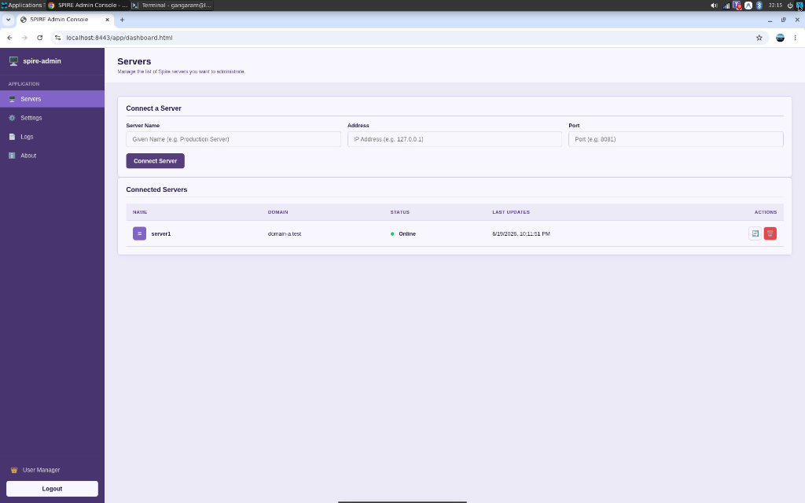
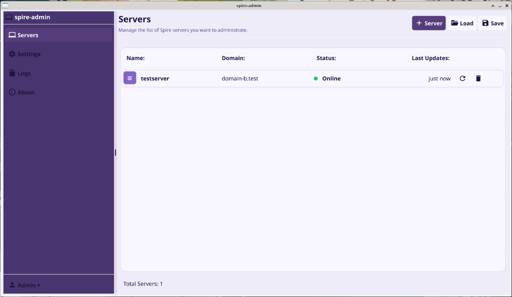

# 🖥️ SPIRE Admin Console (Web & Desktop)

SPIRE Admin Console is a premium, secure administrative interface designed to control, configure, and monitor SPIRE (SPIFFE Runtime Environment) server installations. It provides a visual dashboard for administrators, operating as either a cross-platform desktop application or a remote web-based console.

---

## 📸 Screenshots

### Web Console Interface


### Desktop GUI Application


---

## 🏗️ Architectural Overview

The SPIRE Admin Console runs as a **SPIFFE workload**. 
1. It connects to a local SPIRE Agent's Workload API socket (e.g., `agent.sock`).
2. It automatically and dynamically retrieves its own X.509 SVID (mTLS certificate and private key).
3. Using these SPIFFE credentials, it secures TLS connections to the remote SPIRE Servers' administration endpoints.
4. Once authenticated, administrators can execute commands, manage registrations, control agents, and rotate keys remotely.

```
                   +------------------------+
                   |  Local SPIRE Agent     |
                   +-----------+------------+
                               | Workload API
                               v (agent.sock)
+-------------------------------------------------------+
| SPIRE Admin Console (Web Server / Desktop GUI)        |
+--------------------------+----------------------------+
                           |
                           | Remote gRPC (mTLS)
                           v
+--------------------------+----------------------------+
| Remote SPIRE Server(s)                                |
+-------------------------------------------------------+
```

### 🔗 Server Federation & Authorization Requirements

To allow the SPIRE Admin Console to remotely administer a SPIRE Server (e.g. `domain-a.test`), two main requirements must be satisfied in the target server's HCL configuration:

1. **SPIFFE ID Authorization (`admin_ids`)**:
   The remote SPIRE Server must explicitly authorize the admin workload's SPIFFE ID (`spiffe://admin.app/spire_admin`) to execute administrative gRPC APIs. This is done by adding the ID to the `admin_ids` array in the `server` block:
   ```hcl
   server {
       # ...
       admin_ids = ["spiffe://admin.app/spire_admin"]
   }
   ```

2. **Trust Federation (`federation`)**:
   The remote SPIRE Server must trust the root authority of the Admin Console's trust domain (`admin.app`) to establish mutual TLS (mTLS). This is configured in the server's `federation` block, defining how it retrieves the trust bundle for `admin.app` (typically over HTTPS):
   ```hcl
   server {
       # ...
       federation {
           federates_with "admin.app" {
               bundle_endpoint_url = "https://127.0.0.1:8445"
               bundle_endpoint_profile "https_spiffe" {
                   endpoint_spiffe_id = "spiffe://admin.app/spire/server"
               }
           }
       }
   }
   ```
   *(Refer to [spire_test_setup.sh](file:///work/repositories/gngram/spire-admin/test/spire_test_setup.sh) for the complete multi-domain federation bootstrapping details).*

---

## ✨ Features

Both interfaces share a unified, professional user experience styled with responsive custom CSS themes (`Purple`, `Green`, `Blue`, `Gray`).

### Shared Features (Web & Desktop)
- **Live Server Status Monitoring**: Real-time health checks (`Online`, `Connecting`, `Offline`) indicated by colored status badges and absolute timezone-adjusted timestamps.
- **SPIRE Agent Management**:
  - List all connected agents and view detailed properties (SPIFFE ID, attestation type, expiration, serial number, agent version).
  - Evict (delete) agents.
  - Ban agents.
  - Purge expired agents automatically in bulk.
- **Registration Entries**:
  - Segmented tab panels to organize registration entries for **Workloads**, **Agents**, and **Downstream Servers**.
  - Complete CRUD capability: Create new registrations, view full properties, update fields (DNS names, Hint, TTL, Federates With, downstream/admin status), and delete entries.
- **Federated Trust Bundles**:
  - View trust domain lists and sequence numbers.
  - Display lists of trusted X.509 and JWT authorities.
  - Set/Update federated bundles manually via PEM-encoded certificates.
  - Delete federated trust bundles.
- **Federation Relationships**:
  - List and add dynamic federation relationships with foreign trust domains.
  - Modify bundle endpoint addresses.
  - Refresh federation bundles from remote endpoints immediately.
  - Terminate federation relationships.
- **Local Authority Management**:
  - Monitor local signing keys (Active, Prepared, and Old authority states).
  - Prepare/Generate new authority keys (Rotate).
  - Activate prepared signing keys.
  - Taint and revoke old authorities.
- **Upstream Authority Management**:
  - Taint and revoke upstream X.509 authority trust using the Upstream Subject Key ID (SKID) in hex format.
- **System Logs Console**: Inline scrolling logs console capturing internal application event logs.

### Desktop GUI Specific Features
- **Offline configurations**: Save connected server profiles locally in HCL format, or load existing configurations from file.

### Web Console Specific Features
- **User Manager (Admin only)**: Provision user accounts and define roles (Operators or Administrators) from a secure interface.
- **Interactive SPA**: Clean, responsive, and dynamic single-page application experience.
- **Inactivity Timer**: Automatic session logout after 30 minutes of inactivity.

---

## 🛠️ Getting Started & Local Testing

You can spin up a local SPIRE testing environment simulating an administrative domain and federated test domains to test the SPIRE Admin Console.

### 1. Prerequisites
- **Go** (v1.20+)
- **SPIRE Server & Agent** installed and available in your `PATH`.
- **OpenSSL** (for Web Console HTTPS certificates).

### 2. Start the Local SPIRE Testing Environment
The repository contains a script under `test/spire_test_setup.sh` that sets up:
- An Admin Server (`admin.app` at `127.0.0.1:8081`) and Agent.
- Federated Server A (`domain-a.test` at `127.0.0.1:8082`) and Agent.
- Federated Server B (`domain-b.test` at `127.0.0.1:8083`) and Agent.

Run the script providing a temporary directory for configuration and database files:
```bash
./test/spire_test_setup.sh /tmp/spire-data
```
Keep this terminal running. It will output a summary showing the socket paths and ports once initialization is complete.

---

## 💻 Running the Desktop GUI

Build the desktop application and point it to the admin agent socket created by the test setup:
```bash
# Build the binary
go build ./apps/spire-admin-desktop

# Run pointing to the agent socket
./spire-admin-desktop -socket /tmp/spire-data/spire-admin/agent.sock
```
*Note: Make sure your system environment supports OpenGL for GUI rendering (Fyne framework).*

---

## 🌐 Running the Web Console

### 1. Generate SSL Certificates for HTTPS
Generate local HTTPS development certificates:
```bash
cd apps/spire-admin-web
./generate_certs.sh
cd ../..
```
This produces `cert.pem` and `key.pem` files.

### 2. Build and Launch the Web Server
Build the web server and run it by specifying the agent socket, SSL keys, and target port:
```bash
# Build the binary
go build ./apps/spire-admin-web

# Run the server
./spire-admin-web \
  -socket /tmp/spire-data/spire-admin/agent.sock \
  -cert cert.pem \
  -key key.pem \
  -port 8443
```

### 3. Log In as Administrator
Open your browser and navigate to `https://localhost:8443`.

#### 🔐 Default Credentials & Env Variables
By default, the server provisions a default administrator account:
- **Username**: `admin`
- **Password**: `admin123`

You can override these credentials before starting the web server by setting the `ADMIN_USERNAME` and `ADMIN_PASSWORD` environment variables:
```bash
export ADMIN_USERNAME="my_custom_admin"
export ADMIN_PASSWORD="my_secure_password"
./spire-admin-web -socket /tmp/spire-data/spire-admin/agent.sock -cert cert.pem -key key.pem -port 8443
```

#### 🛡️ HTTPS CA Certificate & Trust Setup
When connecting to a remote web server from a local desktop browser over HTTPS:
1. The web server expects the `-cert` and `-key` parameters to serve TLS traffic.
2. If self-signed certificates were generated (via `./generate_certs.sh`), browsers will display a connection warning. To establish a fully secure HTTPS connection, import the generated root/self-signed CA certificate into the browser's certificate trust store, or use a certificate issued by a trusted public Certificate Authority (CA).

Once logged in, click the **User Manager** tab at the bottom left to create additional operator or administrator accounts.
To monitor the SPIRE server from the console, add `server1` under the Servers tab using:
- **Name**: `Server 1`
- **Address**: `127.0.0.1`
- **Port**: `8081`
