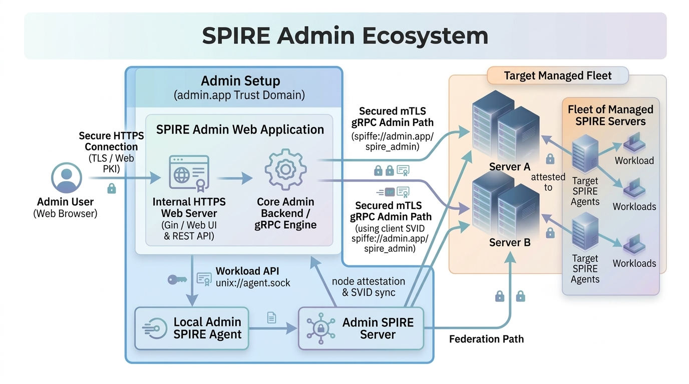
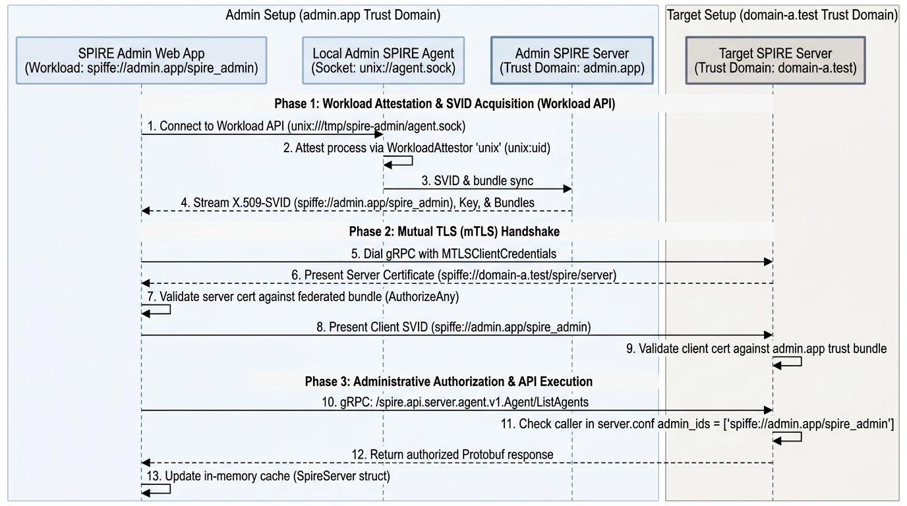

# 🏛️ SPIRE Admin Console - Architecture & Design Document

## 1. System Overview

The **SPIRE Admin Console** is an administrative platform designed to manage and monitor distributed [SPIRE](https://github.com/spiffe/spire) (SPIFFE Runtime Environment) deployments.

The console operates natively as an attested **SPIFFE Workload**. It connects to a local **Admin SPIRE Agent** (which operates under the **Admin SPIRE Server**) via the SPIFFE Workload API over a Unix Domain Socket. Dynamically acquiring and rotating short-lived X.509 SVIDs, the console executes authorized, privileged gRPC administrative operations against target remote SPIRE servers across federated trust domains.

### 1.1 Source Code & File Mapping Matrix

```
spire-admin
├── apps/
│   ├── spire-admin-desktop/
│   │   └── main.go                  # Desktop entry point (flags, logger, UI bootstrap)
│   └── spire-admin-web/
│       ├── main.go                  # Web entry point (TLS flags, socket check, HTTP server)
│       ├── app.go                   # Gin REST controller, route registration & gRPC bridge
│       └── generate_certs.sh        # OpenSSL script for local HTTPS Web PKI certs
├── auth/
│   └── auth.go                      # RBAC, JWT token lifecycle, bcrypt hashing, inactivity tracker
├── servers/
│   ├── spire.go                     # SPIFFE ID retrieval helper via Workload API
│   ├── server.go                    # SpireServer struct, gRPC mTLS dialing, Health, HCL parser
│   ├── agent.go                     # Agent service client (List, Ban, Evict, Purge Expired, Join Tokens)
│   ├── entries.go                   # Entry service client (CRUD, Workload/Agent/Downstream segmentation)
│   ├── bundles.go                   # Bundle service client (Get, Set, List, Delete federated bundles)
│   ├── federations.go               # TrustDomain service client (CRUD relationships, Refresh)
│   ├── signing_authorities.go       # LocalAuthority client (Rotate, Prepare, Activate, Taint, Revoke)
│   └── utils.go                     # Status formatting & human-readable time-ago strings
├── web/                             # Web Frontend Single-Page Application (SPA)
│   ├── login.html                   # Authenticated entry point (Session token acquisition)
│   ├── dashboard.html               # Main administrative dashboard UI
│   ├── admin.html                   # Standalone User Manager view
│   ├── js/
│   │   ├── app.js                   # Client-side auth, inactivity timer (30m), theme sync
│   │   ├── main_win.js              # View switcher, modal handlers, User Manager logic
│   │   ├── server_win.js            # Server list rendering & connection triggers
│   │   ├── agent_win.js             # Agent actions (Evict, Ban, Info, Purge)
│   │   ├── entries_win.js           # Registration entry CRUD & segmented tabs
│   │   ├── bundles_win.js           # Federated bundle CRUD & ASN.1/DER info
│   │   ├── federation_win.js        # Dynamic federation & auto internal server federation
│   │   ├── local_authority_win.go   # Local authority rotation (Prepare, Activate, Taint+Revoke)
│   │   ├── upstream_authority_win.js# Upstream SKID operations
│   │   └── log_win.js               # Auto-scrolling server log viewer
│   └── css/
│       ├── themes.css               # Color scheme definitions (Purple, Green, Blue, Gray)
│       └── app.css                  # UI layout, responsive grids, data tables, modals
└── test/
    └── spire_test_setup.sh          # Multi-domain local SPIRE cluster bootstrapping harness
```

---

## 2. System Architecture & Topology

### 2.1 Topology & Trust Boundaries

The system architecture spans three distinct execution and network trust domains:

1. **Admin Setup**: Comprises the **SPIRE Admin Web Application (Workload)**, the **Local Admin SPIRE Agent**, and the **Admin SPIRE Server**.
2. 🟪 **User Client Layer**: Administrators interacting with Spire Admin via HTTPS Web Browser. The SPIRE admin web application starts a https web server.
3. **Target Domains(Spire Servers)**: Remote or local SPIRE Servers exposing gRPC endpoints for administrative APIs and HTTPS bundle endpoints for federation.



---

## 3. Security & Identity Architecture



The sequence below captures the complete end-to-end identity lifecycle, attestation pipeline, and administrative invocation flow.

- The **SPIRE Admin Web App** runs purely as a client workload. It relies on the **Local Admin Agent** (which is registered with and attested by the **Admin SPIRE Server**) to obtain SVID credentials.
- Uses **X.509-SVIDs** for control plane mutual authentication (mTLS).
- **Trust Verification**: Mutual verification across trust domain boundaries requiring federated bundle exchange.
- **Target Server Authorization**: Admin is configured on target SPIRE servers via HCL attribute `admin_ids = ["spiffe://admin.app/spire_admin"]` along with the federation setup.

---

## 4. Subsystem Architecture

### 4.1 Core Engine (`servers/` package)

The `servers` package forms the core business logic layer shared by both Desktop and Web frontends:

```go
type SpireServer struct {
    mu               sync.RWMutex
    Nickname         string
    Address          string
    Port             string
    Domain           string
    AgentSocket      string
    HealthStatus     ServerHealthStatus // Connecting, Online, Offline
    LastUpdated      time.Time
    Agents           []Agent
    Entries          []Entry
    Bundles          []*types.Bundle
    FederatedServers []FederatedServer
    conn             *grpc.ClientConn
    source           *workloadapi.X509Source
}
```

- **Health Checks**: Uses `google.golang.org/grpc/health/grpc_health_v1` (`Check`) to periodically probe the remote SPIRE server health.
- **Cache Invalidation & Refresh**: `RefreshCache()` concurrently loads agents, registration entries, federated bundles, and trust domain relationships with thread-safe `sync.RWMutex` locking.
- **HCL Configuration Manager**: `SaveServersConfig()` and `LoadServersConfig()` serialize and deserialize server connection profiles into standard HCL format.

### 4.2 Backend Service Implementation & SPIRE SDK v1 Mappings

The table below maps internal Go service methods in [`servers/`](file:///home/gangaram/playground/spire-admin/servers) to their underlying SPIRE API SDK Protobuf gRPC contracts:

| Feature Domain | Go Method | Target SPIRE SDK Interface & Method | Protobuf Request / Response Types |
| :--- | :--- | :--- | :--- |
| **Health Check** | [`CheckHealth()`](file:///home/gangaram/playground/spire-admin/servers/server.go#L256) | `grpc_health_v1.HealthClient.Check` | `HealthCheckRequest` &rarr; `HealthCheckResponse` |
| **Agent Listing** | [`ListAgents()`](file:///home/gangaram/playground/spire-admin/servers/agent.go#L43) | `agentv1.AgentClient.ListAgents` | `ListAgentsRequest` &rarr; `ListAgentsResponse` (paginated) |
| **Agent Info** | [`GetAgentInfo()`](file:///home/gangaram/playground/spire-admin/servers/agent.go#L158) | `agentv1.AgentClient.GetAgent` | `GetAgentRequest{Id}` &rarr; `types.Agent` |
| **Agent Token** | [`CreateJoinToken()`](file:///home/gangaram/playground/spire-admin/servers/agent.go#L101) | `agentv1.AgentClient.CreateJoinToken` | `CreateJoinTokenRequest{Ttl}` &rarr; `types.JoinToken` |
| **Agent Ban** | [`BanAgent()`](file:///home/gangaram/playground/spire-admin/servers/agent.go#L116) | `agentv1.AgentClient.BanAgent` | `BanAgentRequest{Id}` &rarr; `Empty` |
| **Agent Evict** | [`EvictAgent()`](file:///home/gangaram/playground/spire-admin/servers/agent.go#L137) | `agentv1.AgentClient.DeleteAgent` | `DeleteAgentRequest{Id}` &rarr; `Empty` |
| **Purge Expired** | [`PurgeExpiredAgents()`](file:///home/gangaram/playground/spire-admin/servers/agent.go#L191) | `agentv1.AgentClient.ListAgents` + `DeleteAgent` | Filter `ByCanReattest=true`, evaluate `X509SvidExpiresAt` |
| **Entry Listing** | [`ListEntries()`](file:///home/gangaram/playground/spire-admin/servers/entries.go#L23) | `entryv1.EntryClient.ListEntries` | `ListEntriesRequest` &rarr; `ListEntriesResponse` (paginated) |
| **Entry Create** | [`CreateEntry()`](file:///home/gangaram/playground/spire-admin/servers/entries.go#L110) | `entryv1.EntryClient.BatchCreateEntry` | `BatchCreateEntryRequest{Entries}` &rarr; `BatchCreateEntryResponse` |
| **Entry Update** | [`UpdateEntry()`](file:///home/gangaram/playground/spire-admin/servers/entries.go#L176) | `entryv1.EntryClient.BatchUpdateEntry` | `BatchUpdateEntryRequest{Entries}` &rarr; `BatchUpdateEntryResponse` |
| **Entry Delete** | [`DeleteEntry()`](file:///home/gangaram/playground/spire-admin/servers/entries.go#L138) | `entryv1.EntryClient.BatchDeleteEntry` | `BatchDeleteEntryRequest{Ids}` &rarr; `BatchDeleteEntryResponse` |
| **Bundle Get** | [`GetBundle()`](file:///home/gangaram/playground/spire-admin/servers/bundles.go#L43) | `bundlev1.BundleClient.GetBundle` / `GetFederatedBundle` | `GetBundleRequest` / `GetFederatedBundleRequest{TrustDomain}` |
| **Bundle Set** | [`SetFederatedBundle()`](file:///home/gangaram/playground/spire-admin/servers/bundles.go#L142) | `bundlev1.BundleClient.BatchSetFederatedBundle` | `BatchSetFederatedBundleRequest{Bundle}` |
| **Bundle Delete** | [`DeleteFederatedBundle()`](file:///home/gangaram/playground/spire-admin/servers/bundles.go#L76) | `bundlev1.BundleClient.BatchDeleteFederatedBundle` | `BatchDeleteFederatedBundleRequest{TrustDomains, Mode}` |
| **Federations** | [`ListFederationRelationships()`](file:///home/gangaram/playground/spire-admin/servers/federations.go#L102) | `trustdomainv1.TrustDomainClient.ListFederationRelationships` | `ListFederationRelationshipsRequest` (paginated) |
| **Federation Mutate** | [`CreateFederationRelationship()`](file:///home/gangaram/playground/spire-admin/servers/federations.go#L51) | `trustdomainv1.TrustDomainClient.BatchCreateFederationRelationship` | `BatchCreateFederationRelationshipRequest{...}` |
| **Federation Refresh** | [`RefreshFederationBundle()`](file:///home/gangaram/playground/spire-admin/servers/federations.go#L130) | `trustdomainv1.TrustDomainClient.RefreshBundle` | `RefreshBundleRequest{TrustDomain}` &rarr; `Empty` |
| **Local Key State** | [`ShowLocalX509Authorities()`](file:///home/gangaram/playground/spire-admin/servers/signing_authorities.go#L70) | `localauthorityv1.LocalAuthorityClient.GetX509AuthorityState` | `GetX509AuthorityStateRequest` &rarr; `GetX509AuthorityStateResponse` |
| **Local Rotate** | [`PrepareLocalX509Authority()`](file:///home/gangaram/playground/spire-admin/servers/signing_authorities.go#L33) | `localauthorityv1.LocalAuthorityClient.PrepareX509Authority` | `PrepareX509AuthorityRequest` &rarr; `PrepareX509AuthorityResponse` |
| **Local Activate** | [`ActivateLocalX509Authority()`](file:///home/gangaram/playground/spire-admin/servers/signing_authorities.go#L13) | `localauthorityv1.LocalAuthorityClient.ActivateX509Authority` | `ActivateX509AuthorityRequest{AuthorityId}` |
| **Local Taint/Revoke** | [`TaintLocalX509Authority()`](file:///home/gangaram/playground/spire-admin/servers/signing_authorities.go#L87) / [`RevokeLocalX509Authority()`](file:///home/gangaram/playground/spire-admin/servers/signing_authorities.go#L51) | `localauthorityv1.LocalAuthorityClient.TaintX509Authority` / `RevokeX509Authority` | `TaintX509AuthorityRequest` / `RevokeX509AuthorityRequest` |
| **Upstream CA Ops** | [`TaintUpstreamX509Authority()`](file:///home/gangaram/playground/spire-admin/servers/signing_authorities.go#L125) / [`RevokeUpstreamX509Authority()`](file:///home/gangaram/playground/spire-admin/servers/signing_authorities.go#L106) | `localauthorityv1.LocalAuthorityClient.TaintX509UpstreamAuthority` / `RevokeX509UpstreamAuthority` | `TaintX509UpstreamAuthorityRequest{SubjectKeyId}` |

---

### 4.3 REST API Endpoints Specification (`apps/spire-admin-web/app.go`)

The web console exposes a comprehensive RESTful gateway over TLS. All endpoints beneath `/api/` (except `/api/login`) require a valid Bearer JWT header verified via [`auth.Manager.AuthMiddleware()`](file:///home/gangaram/playground/spire-admin/auth/auth.go#L211).

```
POST   /api/login                                 # Authenticate user credentials & issue JWT
GET    /api/logs                                  # Retrieve memory-buffered application logs
GET    /api/servers                               # List all configured server profiles & statuses
POST   /api/servers                               # Add new server profile and connect
DELETE /api/servers/:id                           # Remove server profile and disconnect gRPC
POST   /api/servers/:id/refresh                   # Trigger asynchronous FetchInfo & cache refresh

# Agent Subsystem
GET    /api/servers/:id/agents                    # List connected agents
GET    /api/servers/:id/agents/info?spiffe_id=... # Get detailed properties for single agent
POST   /api/servers/:id/agents/evict              # Evict agent by SPIFFE ID
POST   /api/servers/:id/agents/ban                # Ban agent by SPIFFE ID
POST   /api/servers/:id/agents/purge-expired      # Purge all expired agents in bulk

# Registration Entries Subsystem
GET    /api/servers/:id/entries                   # List all registration entries
GET    /api/servers/:id/entries/workloads         # Segmented workload entries
GET    /api/servers/:id/entries/agents            # Segmented agent entries
GET    /api/servers/:id/entries/downstreams       # Segmented downstream server entries
GET    /api/servers/:id/entries/:entry_id/info    # Get entry details
POST   /api/servers/:id/entries                   # Create registration entry
PUT    /api/servers/:id/entries/:entry_id         # Update entry properties (TTL, DNS, Flags)
DELETE /api/servers/:id/entries/:entry_id         # Delete entry

# Federated Trust Bundles Subsystem
GET    /api/servers/:id/bundles                   # List federated bundles
GET    /api/servers/:id/bundles/info?trust_domain # Get bundle details (X.509/JWT authorities)
POST   /api/servers/:id/bundles                   # Set/Import bundle from PEM content
DELETE /api/servers/:id/bundles?trust_domain      # Delete federated bundle (Mode: RESTRICT)

# Dynamic Federation Subsystem
GET    /api/servers/:id/federations               # List federation relationships
GET    /api/servers/:id/federations/info?trust_...# Get relationship details
POST   /api/servers/:id/federations               # Create federation relationship
PUT    /api/servers/:id/federations               # Update federation relationship
POST   /api/servers/:id/federations/refresh       # Trigger immediate bundle sync
DELETE /api/servers/:id/federations               # Terminate federation relationship
POST   /api/servers/:id/federations/internal      # Automated bilateral internal server federation

# Signing Authorities Subsystem
GET    /api/servers/:id/local-authority           # Query Active, Prepared, Old local authorities
POST   /api/servers/:id/local-authority/rotate    # Prepare new authority key pair
POST   /api/servers/:id/local-authority/activate  # Activate prepared authority
POST   /api/servers/:id/local-authority/delete    # Taint and revoke old authority
POST   /api/servers/:id/upstream-authority/taint  # Taint upstream authority by SKID
POST   /api/servers/:id/upstream-authority/revoke # Revoke upstream authority by SKID

# User Management & Session
POST   /api/change-password                       # Update caller's password
POST   /api/logout                                # Invalidate active session token
POST   /api/users                                 # Provision user (Admin role required)
```

---

### 4.4 Security, Authentication & Session Architecture

Implemented in [`auth/auth.go`](file:///home/gangaram/playground/spire-admin/auth/auth.go):

- **Data Store**: Local encrypted/restricted JSON file ([`users.json`](file:///home/gangaram/playground/spire-admin/users.json), permissions `0600`).
- **Password Security**: Evaluated and hashed using `golang.org/x/crypto/bcrypt`.
- **Default Provisioning**: Defaults to `admin` / `admin123` if no user database exists, overridable at runtime via environment variables `ADMIN_USERNAME` and `ADMIN_PASSWORD`.

## 5. Supported Operations & Capabilities Mapping

The following table shows which standard `spire-server` features are supported by the **SPIRE Admin Console**:

| SPIRE Server Category | Supported in Console | Platform Capabilities | Relevance / Notes |
| :--- | :---: | :--- | :--- |
| **`agent`** | ✅ | View connected agents, inspect agent details, ban or delete agents, and clean up expired agents. | Needed to monitor and manage all active SPIRE agents. |
| **`bundle`** | ✅ | View, upload, and delete root CA certificates (trust bundles) for local and federated domains. | Needed so different servers and domains can trust each other's certificates. |
| **`entry`** | ✅ | Create, view, edit, and delete registration entries for workloads, agents, and downstream servers. | Core feature used to assign identities (SPIFFE IDs) to workloads. |
| **`federation`** | ✅ | Add, update, refresh, and remove federation links between different trust domains. | Needed so workloads in one domain can talk securely to workloads in another domain. |
| **`healthcheck`** | ✅ | Check if remote SPIRE servers are online, connecting, or offline in real time. | Shows live server status directly on the dashboard. |
| **`jwt`** | ❌ | Not available in the console. | Used for testing JWT tokens on the command line; not needed in the admin UI. |
| **`localauthority`** | ✅ | Create new local signing keys, switch to them, and disable old or compromised keys. | Needed to rotate server certificate keys safely without downtime. |
| **`logger`** | ❌ | Not available for remote servers in the console. | Used to change server log levels locally on the host; console has its own log viewer. |
| **`run`** | ❌ | Not available in the console. | Used to start the SPIRE server. Not relevant for admin application. |
| **`token`** | ❌ | Backend code exists, but no button or API is exposed in the UI. | Creates a one time use join token. |
| **`upstreamauthority`** | ✅ | Disable or remove trust for upstream parent CA keys using their Key ID (SKID). | Needed to manage an upstream CA key. Implemented but not tested. |
| **`validate`** | ❌ | Not available in the console. | Checks local configuration files before starting the server; not needed over the network. |
| **`x509`** | ❌ | Not available in the console. | Used for manually testing certificates. |

---

## 6. Security Best Practices

1. **Workload API Socket Permissions**: The SPIRE agent socket (`agent.sock`) must be protected with Unix file permissions (`0600` or `0660`) allowing access only to authorized local processes.
2. **Short Token TTLs**: Join tokens generated for agent attestation should use minimum necessary TTLs.
3. **Audit Logging**: All administrative actions (evictions, bans, entry deletions, key rotation) are logged through the internal structured logger (`logger/`).
4. **Credential Isolation**: The web server never stores or logs plain text passwords; credentials are encrypted and hashed using `bcrypt`.

---

## 7. Roadmap & TODOs

The following features and hardening initiatives to be planned:

- **High-Quality Secure Web Interface**:
  - Modernize and refine the web UI/UX and reinforced web security headers.
- **Application State Persistence & Recovery**:
  - Persist configured server profiles, active connections, and session states across application restarts so the console seamlessly recovers its previous working state. *(HCL profile saving is implemented in the backend, but it should be automated).*
- **Enterprise User Login & Identity Management**:
  - Extend authentication beyond local file-based accounts(for debug only) to support enterprise identity solutions:
    - **Active Directory (AD) / LDAP** integration.
    - **Public Key?** authentication.
    - **OIDC / SAML Single Sign-On (SSO)?**.
- **Code Audit & Threat Modeling**:
  - Perform comprehensive code auditing and formal Zero-Trust threat modeling covering trust domain boundaries, mTLS transport channels, socket permissions, and gRPC authorization flows.
- **Interactive SPIRE Config Builder?**:
  - Implement a guided configuration generator for `spire-server` and `spire-agent` to eliminate tedious manual HCL writing for plugin blocks (datastores, node/workload attestors, key managers) and multi-domain federation endpoints.
- **Backend Code Refactoring**:
  - The application comprises a central server structure which implements admin APIs. Though APIs are implemented in separate files logically, it's better to have a dedicated structure for each category and abstract them in the central server struct.
